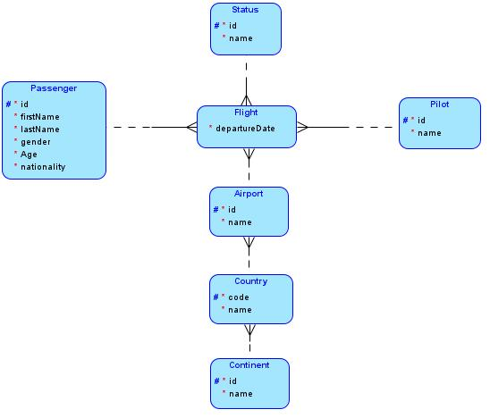
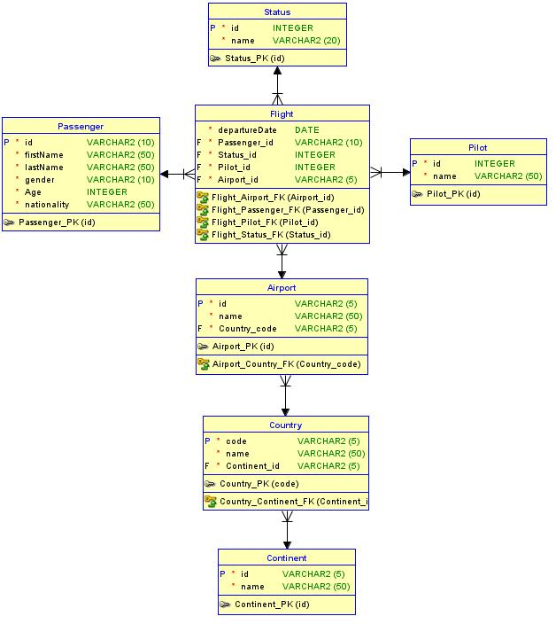

*Universidad de San Carlos de Guatemala*  
*Facultad de Ingenieria*  
*Escuela de Ciencias y Sistemas*  
*Seminario De Sistemas 2*  
*Segundo Semestre 2024.*  

___
## **Practica 1**
### **Proceso ETL**
___
**201908355 - Danny Hugo Bryan Tejaxún Pichiyá**

## Modelos
### Lógico


### Físico


## Modelo Data Warehouse
El el Data WareHouse utiliza el modelo de *Copo de Nieve*.  
Fue necesario usar dicho modelo ya que la información se centra generalmente en *Flights* (Vuelos) y teniendo en cuenta que es posible normalizar la información de *Country* (Paises) y *Contient* (Continente) se optó por usar dicho modelo.

* Dimensiones
    * Passenger
    * Status
    * Pilot
    * Airport
    * Country
    * Continent
* Hechos
    * Flight

## Proceso ETL
* Se extrajo la información de archivos csv para insertarlos en una tabla temporal.  
* La transformación se hizo antes de cargar la información que se guardó en la tabla temporal.  
    * Para las tablas *dimensiones* sin llaves foráneas del modelo se insertaron solo datos únicos.
    * Para las tablas *dimensiones* con llaves foráneas solo se insertaron datos que ya existen previamente en las tablas a las que se les hayan insertado registros anteriormente.
    * Para la tabla de *hecho* se buscó únicamente en cada registro que coincidera con los de las tablas que ya tienen registros, de lo contrario no se inserta el registro en la tabla.  
* La carga se realizó extrayendo la información transformada de la tabla temporal para insertarlos en las tablas normalizadas.

## Resultados
```
1. Count De Todas Las Tablas
+----+-----------+-------+
| No |   Table   | Count |
+----+-----------+-------+
| 1  |   Status  |   3   |
| 2  |   Pilot   | 93627 |
| 3  | Continent |   7   |
| 4  |  Country  |  210  |
| 5  |  Airport  |  7431 |
| 6  | Passenger | 98617 |
| 7  |   Flight  | 80602 |
+----+-----------+-------+

2. Porcentaje De Pasajeros Por Género
+--------+-----------------+
| Gender |    Percentaje   |
+--------+-----------------+
|  Male  | 50.290000000000 |
| Female | 49.710000000000 |
+--------+-----------------+


3. Nacionalidades Con Su Mes-Año De Mayor Fecha De Salida
+-----+----------------------------------------------+------------+---------+
|  No |                 Nationality                  | Month-Year | Flights |
+-----+----------------------------------------------+------------+---------+
|  1  |                 Afghanistan                  |  06-2022   |    34   |
|  2  |                Aland Islands                 |  04-2022   |    3    |
|  3  |                   Albania                    |  01-2022   |    38   |
|  4  |                   Algeria                    |  01-2022   |    2    |
|  5  |                American Samoa                |  06-2022   |    6    |
|  6  |                   Andorra                    |  11-2022   |    2    |
|  7  |                    Angola                    |  06-2022   |    9    |
|  8  |                   Anguilla                   |  09-2022   |    1    |
|  9  |             Antigua and Barbuda              |  05-2022   |    2    |
|  10 |                  Argentina                   |  07-2022   |   107   |
...
| 229 |                   Uruguay                    |  09-2022   |    13   |
| 230 |                  Uzbekistan                  |  10-2022   |    17   |
| 231 |                   Vanuatu                    |  11-2022   |    3    |
| 232 |                  Venezuela                   |  01-2022   |    37   |
| 233 |                   Vietnam                    |  08-2022   |    69   |
| 234 |              Wallis and Futuna               |  01-2022   |    2    |
| 235 |                Western Sahara                |  05-2022   |    2    |
| 236 |                    Yemen                     |  10-2022   |    39   |
| 237 |                    Zambia                    |  05-2022   |    12   |
| 238 |                   Zimbabwe                   |  05-2022   |    10   |
+-----+----------------------------------------------+------------+---------+

4. Count De Vuelos Por País
+--------------------------------------+---------+
|               Country                | Flights |
+--------------------------------------+---------+
|               Finland                |   279   |
|                Rwanda                |    50   |
|               Bahrain                |    12   |
|           Christmas Island           |    11   |
|               Liberia                |   149   |
|               Andorra                |    7    |
|                Uganda                |   150   |
|                Monaco                |    7    |
|                Egypt                 |   304   |
|                Brazil                |   2312  |
...
|              Mauritania              |   164   |
|                Niger                 |    58   |
|          Russian Federation          |   2019  |
|                Nepal                 |   437   |
|                Zambia                |   221   |
|               Portugal               |   211   |
|              Kazakhstan              |   249   |
|               Anguilla               |    14   |
|              Costa Rica              |   283   |
|               Paraguay               |   128   |
+--------------------------------------+---------+

5. Top 5 Aeropuertos Con Mayor Número De Pasajeros
+-----+----------------------+------------+
| Top |       Airport        | Passengers |
+-----+----------------------+------------+
|  1  | Santa Maria Airport  |    148     |
|  2  |  San Pedro Airport   |    126     |
|  3  |  Santa Ana Airport   |    105     |
|  4  | San Fernando Airport |     93     |
|  5  | Capital City Airport |     81     |
+-----+----------------------+------------+

6. Count Divido Por Estado De Vuelo
+-----------+---------+
|   Status  | Flights |
+-----------+---------+
| Cancelled |  26899  |
|  Delayed  |  26880  |
|  On Time  |  26823  |
+-----------+---------+

7. Top 5 De Los Países Más Visitados
+-----+------------------+---------+
| Top |     Country      | Flights |
+-----+------------------+---------+
|  1  |  United States   |  19922  |
|  2  |    Australia     |   6324  |
|  3  |      Canada      |   4560  |
|  4  | Papua New Guinea |   4015  |
|  5  |      China       |   2571  |
+-----+------------------+---------+

8. Top 5 De Los Continentes Más Visitados
+-----+---------------+---------+
| Top |   Continent   | Flights |
+-----+---------------+---------+
|  1  | North America |  27996  |
|  2  |      Asia     |  14617  |
|  3  |    Oceania    |  13330  |
|  4  |     Africa    |   9049  |
|  5  |     Europe    |   8982  |
+-----+---------------+---------+

9. Top 5 De Edades Divido Por Género Que Más Viajan
+-----+-----+--------+---------+
| Top | Age | Gender | Flights |
+-----+-----+--------+---------+
|  1  |  39 | Female |   616   |
|  2  |  89 |  Male  |   615   |
|  3  |  46 |  Male  |   604   |
|  4  |  24 |  Male  |   597   |
|  5  |  29 |  Male  |   590   |
+-----+-----+--------+---------+

10. Count de vuelos por MM-YYYY
+------------+---------+
| Month-Year | Flights |
+------------+---------+
|  01-2022   |   6879  |
|  02-2022   |   6311  |
|  03-2022   |   6876  |
|  04-2022   |   6542  |
|  05-2022   |   6870  |
|  06-2022   |   6683  |
|  07-2022   |   6870  |
|  08-2022   |   6975  |
|  09-2022   |   6638  |
|  10-2022   |   6870  |
|  11-2022   |   6571  |
|  12-2022   |   6517  |
+------------+---------+
```