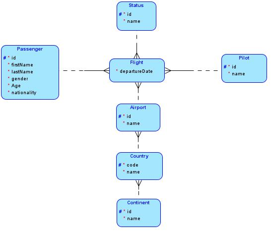
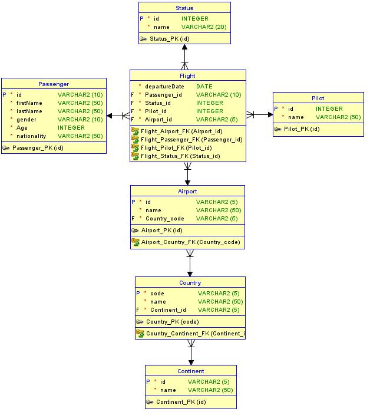

*Universidad de San Carlos de Guatemala*  
*Facultad de Ingenieria*  
*Escuela de Ciencias y Sistemas*  
*Seminario De Sistemas 2, Segundo Semestre 2024.*  

___
## **Practica 1**
### **Proceso ETL**
___
**201908355 - Danny Hugo Bryan Tejaxún Pichiyá**

## Modelos
### Lógico

### Físico

## Modelo Data Warehouse
El el Data WareHouse utiliza el modelo de *Copo de Nieve*.  
Fue necesario usar dicho modelo ya que la información se centra generalmente en *Flights* (Vuelos) y teniendo en cuenta que es posible normalizar la información de *Country* (Paises) y *Contient* (Continente) se optó por usar dicho modelo.

* Dimensiones
    * Passenger
    * Status
    * Pilot
    * Airport
    * Country
    * Continent
* Hechos
    * Flight

## Proceso ETL
Se extrajo la información de archivos csv para insertarlos en una tabla temporal.  
La transformación se hizo antes de cargar la información que se guardó en la tabla temporal.  
La carga se realizó extrayendo la información transformada de la tabla temporal para insertarlos en las tablas normalizadas.

## Resultados
